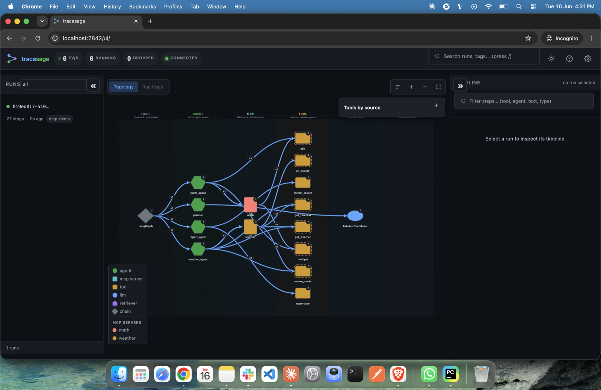
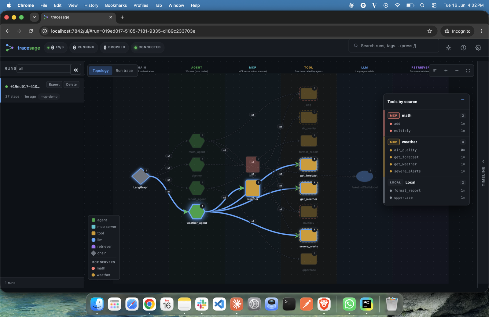
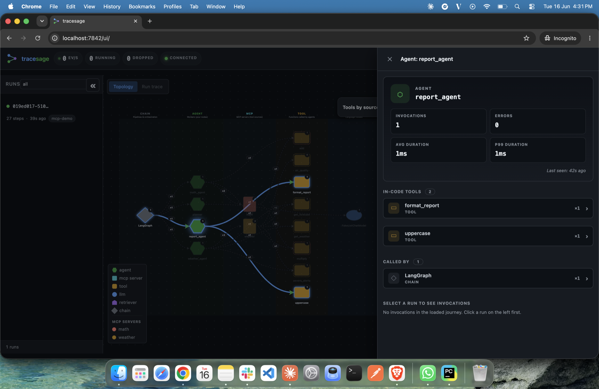

<div align="center">


# tracesage

**Local-first observability for LangChain & LangGraph multi-agent systems.**
Drop in two lines, see live execution traces in your browser.

[](https://pypi.org/project/tracesage/)
[](https://pypi.org/project/tracesage/)
[](LICENSE)
[](https://github.com/kjgpta/tracesage/actions/workflows/ci.yml)
[](https://kjgpta.github.io/tracesage/)
[](#status)

</div>

```python
from tracesage import TraceSage

# Illustrative only — `await` runs inside an async function. See Quick start
# below for a complete, runnable `async def main()`.
tracer = await TraceSage.create()                          # one-time setup

result = await graph.ainvoke(
    {"input": payload},
    config={"callbacks": [tracer.handler]},                # only line you add
)

# Open http://localhost:7842/ui to see the trace live
```

---

## Contents

- [Why tracesage](#why-tracesage)
- [Install](#install)
- [Quick start](#quick-start)
- [Screenshots](#screenshots)
- [Concepts: topology node kinds](#concepts-topology-node-kinds)
- [Features](#features)
- [Examples](#examples)
- [Documentation](#documentation)
- [Comparison](#comparison)
- [Performance](#performance)
- [Status](#status)
- [Contributing](#contributing)
- [License](#license)

---

## Why tracesage

LangChain agents emit a rich callback stream — chain start/end, tool start/end,
LLM start/end, retrieval, errors. **tracesage** captures all of it without
changing your workflow logic, persists it locally (SQLite + gzipped blobs),
and renders it in an interactive graph + timeline UI in real time.

- **Zero infrastructure.** No Docker. No Postgres. No external services. `pip install`.
- **Two-line integration.** One callback added to your existing `ainvoke`.
- **Crash-safe by design.** The handler never raises and the tracer never crashes
  your pipeline.
- **Interactive graph view.** Custom SVG graph (no framework), auto-laid-out. Hover, click, replay any run.
- **MCP-aware.** Tools loaded from MCP servers are attributed by source, so you can
  see which tools came from which server vs. which are hardcoded. See [docs/mcp.md](docs/mcp.md).
- **OpenTelemetry export.** Optionally ship every trace as OTel spans to your collector /
  Tempo / Jaeger / Datadog / Honeycomb — the bridge from the local dev view to your
  production stack (config-driven; see [docs/configuration.md](docs/configuration.md#opentelemetry-export)).
- **Multi-app friendly.** Run several apps at once: each auto-binds a free port (7842, 7843, …),
  shows its `TRACESAGE_PROJECT_NAME` in the UI header, and keeps its own data dir — no clashes.
- **Pluggable storage.** SQLite today; Postgres / remote-collector / object-store backends planned (see [`production_roadmap.md`](production_roadmap.md)).
- **MIT licensed.** Free forever.

## Install

```bash
pip install tracesage[langchain]
```

Requires **Python 3.11+**. The `[langchain]` extra pulls `langchain-core`;
that's the only mandatory third-party dep beyond the standard FastAPI /
aiosqlite / pydantic stack. If your app uses **LangGraph**, also `pip install
langgraph` (tracesage doesn't pull it).

tracesage is **provider-agnostic** — it traces LangChain's callback stream, so
OpenAI / Anthropic / local models are all captured automatically; there's no
provider setting in tracesage. Install whichever provider you use:

```bash
pip install langchain-openai      # OPENAI_API_KEY=...
pip install langchain-anthropic   # ANTHROPIC_API_KEY=...
```

For MCP tool-source attribution (loads tools from MCP servers and tags them by
source), install the `mcp` extra:

```bash
pip install 'tracesage[mcp]'
```

## Quick start

**See it in 5 seconds** — seed a sample trace and open the UI:

```bash
tracesage demo
```

**Sync scripts / notebooks** — wrap your code; every LangChain call is captured
automatically (no `callbacks=` wiring) and a clickable trace link is printed:

```python
import tracesage

with tracesage.trace() as tl:          # starts the UI + global capture
    result = agent.invoke("your input")     # 🔍 tracesage: http://127.0.0.1:7842/ui/#run=...
    input("Trace ready — open the printed link, then Enter to exit.")  # keep the UI up
```

(The embedded UI stops when the `with` block / process exits; traces persist to
`~/.tracesage`, so you can also reopen them later with `tracesage serve`.)

**Async apps** — use the context manager (or `await TraceSage.create()` for full control):

```python
import asyncio
from tracesage import TraceSage

async def main():
    async with TraceSage.session(install=True) as tl:   # install=True → global capture
        await graph.ainvoke({"input": "your payload"}, config={"tags": ["my-system"]})
        await tl.flush()                                 # ensure events are persisted
        print(tl.run_url("<run_id>"))                    # deep link to a run

asyncio.run(main())
```

Prefer explicit wiring? Pass `config={"callbacks": [tl.handler]}` instead of `install=True`.

That's it. Open **http://localhost:7842/ui** and explore.

### Developer workflow

Once you have traces, debug them without leaving your terminal:

```bash
tracesage show <run_id>          # render a run as a tree in the terminal
tracesage watch <run_id>         # live-tail events as they stream
tracesage diff <run_a> <run_b>   # compare two runs (tokens, tools, errors)
tracesage view trace.jsonl       # open an exported trace in the UI directly
```

**Test your agents** — the `tracesage_capture` pytest fixture is auto-registered:

```python
def test_agent_uses_search(tracesage_capture):
    agent.invoke("find me a hotel")
    tracesage_capture.assert_tool_called("search")
    tracesage_capture.assert_no_errors()
    assert tracesage_capture.total_tokens()[0] < 5000
```

See **[`docs/development.md`](docs/development.md)** for the full developer guide, and
**[`examples/showcase/`](examples/showcase/)** for 30 before/after apps across popular use cases.

## Screenshots

<table>
  <tr>
    <td width="50%"></td>
    <td width="50%"></td>
  </tr>
  <tr>
    <td align="center"><em>Live topology — agents, tools, LLMs and MCP servers across a run.</em></td>
    <td align="center"><em>“Tools by source” — every tool grouped by origin (MCP servers vs. local).</em></td>
  </tr>
  <tr>
    <td width="50%"></td>
    <td width="50%"></td>
  </tr>
  <tr>
    <td align="center"><em>MCP server inspector — invocations, errors, provided tools and callers.</em></td>
    <td align="center"><em>Agent inspector — a node’s in-code tools and what called it.</em></td>
  </tr>
</table>

### Watch a trace stream in

[](https://kjgpta.github.io/tracesage/#watch-a-trace-stream-in)

_Sped-up preview — [watch the full-quality clip](docs/assets/tracesage-demo.mp4), or see it play inline on the [docs site](https://kjgpta.github.io/tracesage/#watch-a-trace-stream-in)._

## Concepts: topology node kinds

When you open the UI, every node in the topology graph is one of five event-based
kinds — plus a synthesized **`mcp`** node when you attribute tools to an MCP server.
Knowing what each means is the prerequisite to reading a trace:

| Kind | What it is | Examples you'll see |
|---|---|---|
| **`agent`** | A function **you** registered as a LangGraph node, that calls other components | `agent:billing_agent`, `agent:fact_extractor`, `agent:supervisor` |
| **`tool`** | A side-effect function (DB query, API call, calculation) decorated with `@tool` | `tool:lookup_account`, `tool:run_sql`, `tool:cite_sources` |
| **`llm`** | A language-model call (chat or completion) | `llm:FakeListChatModel`, `llm:ChatOpenAI`, `llm:ChatAnthropic` |
| **`retriever`** | A `BaseRetriever` subclass — the "R" in RAG | `retriever:Chroma`, `retriever:FAISS`, `retriever:_FixedCorpusRetriever` |
| **`chain`** | Plumbing — LCEL primitives, the LangGraph orchestrator, routing functions | `chain:LangGraph`, `chain:RunnableSequence`, `chain:ChatPromptTemplate`, `chain:route_after_quality` |
| **`mcp`** | An MCP server (synthesized) — groups the tools loaded from it | `mcp:weather`, `mcp:math`, `mcp:github` |

Quick mental model:

- **`agent`** is your code that *calls* something. It does reasoning.
- **`tool`** does the actual side-effect work and returns a result.
- **`llm`** is what you count, cost, and cache.
- **`retriever`** is its own dimension — "did we find the right docs?"
  is a different question from "did the LLM use them well?".
- **`chain`** is the wrapping machinery (the `prompt | llm | parser`
  pipe operator, the LangGraph state machine, routing functions). It's
  infrastructure, not business logic.
- **`mcp`** groups tools by the MCP server they came from — provenance, so you can
  tell server-provided tools from your hardcoded ones (see [docs/mcp.md](docs/mcp.md)).

Read the full reference at **[`docs/concepts.md`](docs/concepts.md)** —
it covers how tracesage classifies events into kinds, why agents with no
descendants get demoted to `chain`, and walks through a research-pipeline
topology piece by piece.

## Features

### Live interactive UI

- **Run list** with status badges (running / completed / failed), search, status filter
- **SVG graph** showing agents, tools, and execution paths — pulses as events arrive
- **MCP attribution** — `mcp:` server nodes with per-server colors, agent→server and
  server→tool edges, and a draggable "Tools by source" panel grouping tools by origin
- **Timeline** with click-to-expand step cards — each step shows its full **request and
  response** payloads (inputs/prompt + outputs/result) paired together, plus tokens,
  duration, and errors; MCP-backed tools are tagged with their server
- **Replay** mode that re-animates a run at 1x / 2x / 5x speed
- **Dark / light themes**, persisted in `localStorage`
- **Keyboard shortcuts:** `j`/`k` next/prev run, `/` focus search, `t` toggle theme, `Esc`, `?`

### Production safety

- Refuses to bind non-loopback addresses without `auth_token` (hard fail-stop)
- Bearer-token HTTP auth + WebSocket auth via `?token=` or subprotocol
- Constant-time token comparison
- Path-traversal blocked at runtime
- Per-run event cap (circuit breaker) and root-level sampling for high volumes
- Bounded internal state (no unbounded memory growth in long-running processes)
- **Kill switch:** `TRACESAGE_ENABLED=false` makes it a complete no-op (no server, no
  DB/worker, no-op handler) — integrate once, disable per-environment. See
  [docs/production.md](docs/production.md).

### OpenTelemetry export (bridge to production)

tracesage's own UI/CLI is the **local developer-loop** view. To get agent traces into a
**production observability stack**, point `otlp_endpoint` at any OTLP/HTTP collector —
every trace is *also* emitted as OpenTelemetry spans (the local SQLite store stays too):

```bash
pip install "tracesage[otel]"
export TRACESAGE_OTLP_ENDPOINT=http://localhost:4318      # or set in TraceSageConfig
```

```python
from tracesage import TraceSageConfig
# pass to TraceSage.create() / .session() / tracesage.trace():
cfg = TraceSageConfig(otlp_endpoint="http://localhost:4318", otlp_service_name="my-agent")
```

**Where it helps:** the spans land in whatever OTLP-compatible backend you already run —
**Grafana Tempo, Jaeger, Datadog, Honeycomb, Arize/Phoenix, an OTel Collector** — so agent
traces sit alongside the rest of your services (correlated with HTTP/DB spans, long-term
retention, alerting, multi-service/multi-process views) with **no vendor lock-in**. Mapping:
`root_run_id`→trace, `run_id`→span, `parent_run_id`→parent; tokens/errors/MCP server become
span attributes. Best-effort — if the collector is down, tracing continues and your app is
never affected.

> **Note — it's config-driven, not a UI toggle.** There's no button in tracesage's UI to
> turn this on. You enable it via config/env *before* tracing starts, and the exported
> traces appear in **your OTel backend's** UI (Grafana/Jaeger/Datadog/…), not in
> tracesage's own UI. tracesage's UI always shows the local SQLite view. See
> [docs/configuration.md](docs/configuration.md#opentelemetry-export).

### CLI

```bash
tracesage serve  --data-dir ~/.tracesage          # read-only viewer
tracesage export --run-id RUN_ID -o trace.jsonl   # export to JSONL
tracesage import -i trace.jsonl                   # import a JSONL export
tracesage stats  --data-dir ~/.tracesage          # summary stats
tracesage runs   --status failed --limit 20       # list runs
tracesage gc     --max-runs 10000                 # retention cleanup
tracesage doctor --data-dir ~/.tracesage          # data-dir diagnostics
tracesage version
```

See [`docs/cli.md`](docs/cli.md) for full reference.

## Examples

The [`examples/`](examples/) directory has three tiers:

- **[`getting_started/`](examples/getting_started/)** — 3 standalone demos driven by
  `FakeListChatModel` (**no API key**): smart-search agent, research supervisor, RAG.
- **[`mcp/`](examples/mcp/)** — tools from 2 local MCP servers + 2 hardcoded tools,
  attributed by source in the topology (needs `tracesage[mcp]`).
- **[`showcase/`](examples/showcase/)** — **30 real before/after apps** across popular use
  cases (customer support, RAG, multi-agent, MCP, reasoning loops, finance/legal/insurance).
  Each ships a plain `before.py` and an `after.py` with tracesage added, so `diff` shows the
  exact integration.

```bash
# instant, no key:
python examples/getting_started/01_smart_search_agent.py       # then open http://localhost:7842/ui

# the real-world gallery (needs an LLM key):
pip install -r examples/showcase/requirements.txt
export OPENAI_API_KEY=...
python examples/showcase/01_support_faq_router/after.py
```

The **[showcase gallery](examples/showcase/)** has 30 before/after apps spanning
LangChain + LangGraph: routing, parallel fan-out, the supervisor pattern, RAG variants,
writer-critic loops, map-reduce, MCP, self-correction, and finance/legal/insurance verticals.

## Documentation

| Doc | What's in it |
|---|---|
| [Quickstart](docs/quickstart.md) | First trace in five minutes |
| [Developer guide](docs/development.md) | Trace links, sync/notebook setup, CLI debugging, pytest fixture |
| [Configuration](docs/configuration.md) | Every `TRACESAGE_*` env var explained |
| [CLI reference](docs/cli.md) | All `tracesage` subcommands |
| [Production guide](docs/production.md) | Sampling, auth, retention, deployment |
| [Comparison](docs/comparison.md) | tracesage vs LangSmith / LangFuse / Phoenix |
| [Extending tracesage](docs/extending.md) | Adding framework adapters and storage backends |
| **[Examples](examples/showcase/)** | **30 before/after apps with tracesage added** |

## Comparison

When to use `tracesage` vs alternatives:

| | tracesage | LangSmith | LangFuse | Phoenix |
|---|---|---|---|---|
| Zero infra | ✓ | cloud / enterprise self-host | Docker + Postgres | ✓ |
| Pure pip install | ✓ | ✓ (cloud) | ✗ | ✓ |
| Live UI | ✓ | ✓ | ✓ | ✓ |
| MIT licensed | ✓ | proprietary | MIT | Elastic v2 |
| Eval framework | non-goal | ✓ | ✓ | ✓ |
| OpenTelemetry export | ✓ (0.2+) | partial | ✓ | ✓ |

See [`docs/comparison.md`](docs/comparison.md) for the full breakdown.

## Performance

Bench results (5,000 events, 100 distinct run_ids, 20% blob-eligible):

| Platform | Sustained | p99 write | Drops |
|---|---|---|---|
| Linux x86 + NVMe | 800–1200 ev/s | 80–150 ms | 0 |
| Windows NTFS | 60–100 ev/s | 1–2 s | 0 |

Windows NTFS is the bottleneck (gzip + fsync amplification). For very high
throughput on Windows, raise `TRACESAGE_WORKER_BATCH_SIZE` to 200 and
`TRACESAGE_WORKER_BATCH_TIMEOUT` to 0.5.

## Status

**Beta.** API may still shift before v1.0. The PyPI badge at the top shows the published
version; it's stamped by the release workflow **when a version actually ships** (so it
matches PyPI and never gets ahead of a release). Built for local development and
single-process tracing; centralized multi-process / remote-collector mode is
on the roadmap (see [`production_roadmap.md`](production_roadmap.md)).

See [the changelog](docs/changelog.md) for release notes.

## Contributing

Issues and pull requests are welcome.

- Read [`docs/contributing.md`](docs/contributing.md) before sending a PR
- For non-trivial changes, open a [discussion](https://github.com/kjgpta/tracesage/discussions/categories/ideas) first
- Bugs and feature requests use the [issue templates](https://github.com/kjgpta/tracesage/issues/new/choose)
- Security reports: see [`SECURITY.md`](.github/SECURITY.md) — please don't open public issues for vulnerabilities
- All participation is governed by the [Code of Conduct](.github/CODE_OF_CONDUCT.md)

## License

[MIT](LICENSE) © tracesage contributors
