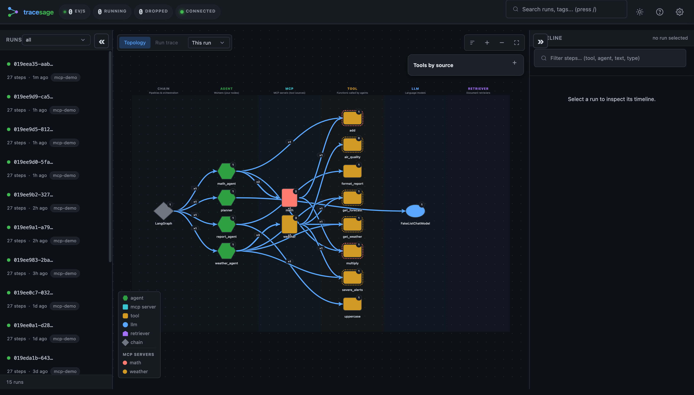
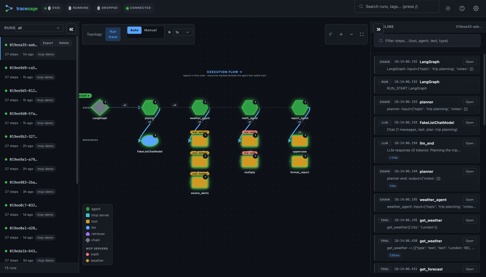
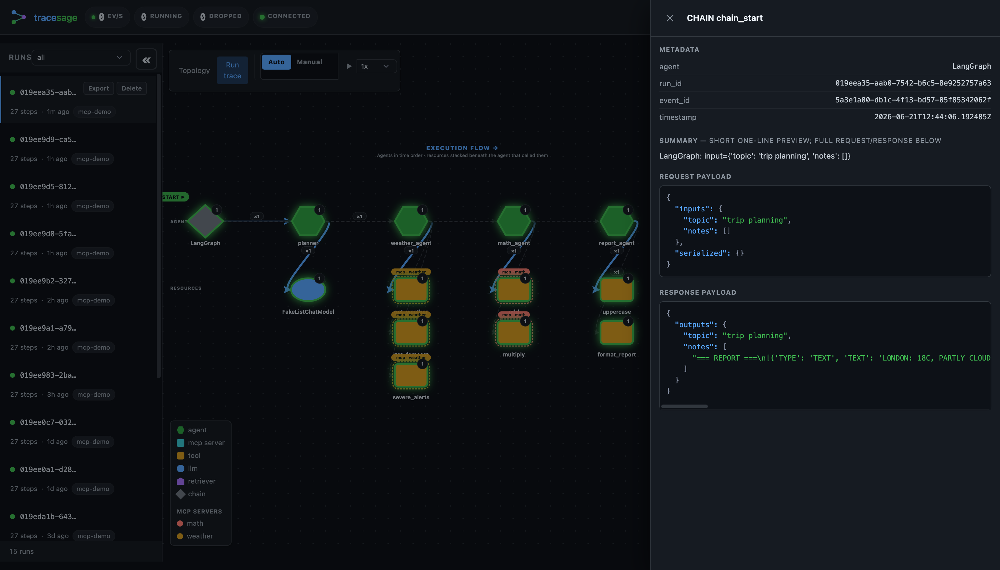
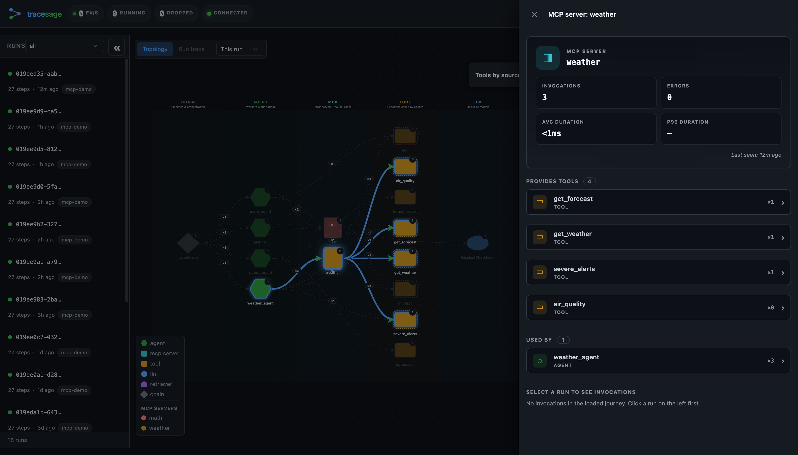
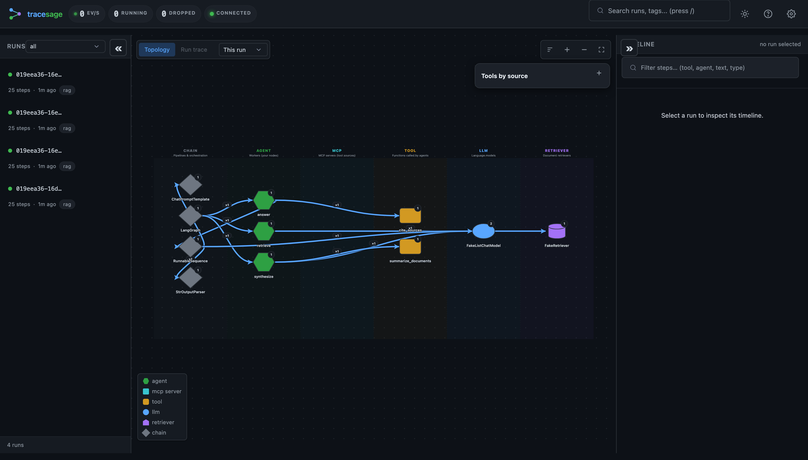

# You Don't Need LangSmith to Trace LangGraph

*Local-first LangGraph tracing — two lines of code, a live trace UI, zero cloud.*

---

You built a LangGraph agent. It works… until it doesn't. A tool gets called twice,
the supervisor routes to the wrong node, the token bill creeps up, and your only
window into any of it is a wall of `print()` statements scrolling past in the
terminal.

The usual answer is **LangSmith** — and it's good. But it also means a cloud
account, an API key, and shipping every prompt, tool call, and response off your
machine to someone else's servers. For local development, that's a lot of
ceremony (and a lot of data leaving your laptop) just to *see what your graph is
doing*.

Here's the thing: **you don't need any of that to trace LangGraph.**

```python
import tracesage

async with tracesage.session(install=True):        # ← line 1
    await graph.ainvoke({"input": "plan me a trip"})  # ← your existing call
```

That's it. No account, no Docker, no Postgres. A browser tab opens with a live,
interactive trace of your run:


*The whole system at a glance: the LangGraph orchestrator fans out to agents, which
call tools — some from MCP servers (weather, math), some local — plus the LLM and
retriever. Everything is captured from LangChain's callback stream; nothing left
the machine.*

This is **[tracesage](https://github.com/kjgpta/tracesage)** — a local-first
observability tool for LangChain & LangGraph. Let me show you what it does, and why
"local-first" is the whole point.

---

## The 60-second setup

```bash
pip install "tracesage[langchain]"
```

> Quote the brackets — zsh (the macOS default shell) treats `[...]` as a glob and
> will otherwise complain `no matches found`.

Then either flip on global capture (no `callbacks=` wiring needed)…

```python
import asyncio
from tracesage import TraceSage

async def main():
    async with TraceSage.session(install=True) as tl:   # global capture + UI
        await graph.ainvoke({"input": "plan me a trip"})
        await tl.flush()
        print("trace UI:", tl.ui_url)                    # open this

asyncio.run(main())
```

…or pass the handler explicitly if you prefer:

```python
await graph.ainvoke(
    {"input": "plan me a trip"},
    config={"callbacks": [tl.handler]},   # the only line you add
)
```

Want to see it work **right now**, with no API key? tracesage ships no-key demos
that use a fake chat model:

```bash
python examples/mcp/main.py        # multi-agent + MCP tools
# then open the URL it prints (default http://localhost:7842/ui)
```

tracesage is **provider-agnostic** — it traces LangChain's callback stream, so
OpenAI, Anthropic, local models, whatever you wire up are all captured the same
way. There's no provider setting.

---

## What you actually get

### 1. A live topology of your system

Every node is one of a few kinds — `agent`, `tool`, `llm`, `retriever`, `chain` —
plus a synthesized `mcp` node per MCP server. You can *see* the architecture: who
calls what, which tools came from where, where the LLM and retriever sit. It pulses
as events stream in over a WebSocket.

The topology defaults to the **currently selected run**, so a tool you removed two
iterations ago doesn't haunt the graph forever (a toolbar selector switches to
last-N-runs or all-time when you want the bigger picture).

### 2. Run trace + a step-by-step timeline

Click any run and the graph flips to **execution-flow** mode — the actual path this
run took — alongside a chronological timeline of every callback event. Hit play and
it re-animates the run step by step:


*Left: the path this run took through the graph. Right: every step in order — chain
starts, the LLM call, each tool invocation — with timestamps and durations. Replay
at 1×/2×/5×.*

### 3. Full request *and* response payloads

This is the part that replaces your `print()` debugging. Click a step and you get
its complete input and output — the exact prompt that went in, the exact result
that came back, plus metadata, duration, and any error with a full traceback:


*The request payload and response payload, paired together for a single step — no
more guessing what your chain actually received.*

### 4. Tap into any node for its stats

Click any node in the graph — an agent, a tool, an MCP server — and a drawer opens
with everything tracesage knows about it: invocation count, error count, average
and p95 duration, the tools it provides or uses, and who calls it.


*Click the `weather` MCP server node → it lists its invocations, error rate,
durations, **all four tools it provides**, and which agents use it. Click an agent
instead and you get its in-code tools, the MCP servers it depends on, and what
called it.*

For real LLM calls (OpenAI, Anthropic, …), each LLM step also shows **token usage** —
`↑input ↓output` — and every run rolls those up into totals you can compare across
runs with `tracesage diff`. (The no-key demos use a fake model that reports none, so
they show no token badges.)

### 5. MCP tool-source attribution

If your agent loads tools from [MCP](https://modelcontextprotocol.io) servers,
tracesage attributes each tool call back to the server it came from — so you can
tell *"these 4 tools are from the weather server, these 2 are hardcoded"* at a
glance. As far as I know, no other LangChain tracer does this; it shows up as `mcp:`
nodes in the graph and a dedicated **"Tools by source"** panel.

### 6. It works for RAG too

`retriever` is a first-class node kind, so RAG pipelines render cleanly — prompt
template → retriever → LLM → output:


*A retrieval pipeline: the `retriever` node (pink) is its own dimension, so "did we
fetch the right docs?" stays a separate question from "did the LLM use them well?".*

---

## Debug from the terminal, too

Not everything needs a browser. The CLI reads the same local data:

```bash
tracesage show <run_id>          # render a run as a tree in your terminal
tracesage watch <run_id>         # live-tail events as they stream
tracesage diff <run_a> <run_b>   # compare two runs: tokens, tools, errors
tracesage runs --status failed   # find the runs that broke
```

And there's a pytest fixture for asserting on agent behavior in CI:

```python
def test_agent_uses_search(tracesage_capture):
    agent.invoke("find me a hotel")
    tracesage_capture.assert_tool_called("search")
    tracesage_capture.assert_no_errors()
```

---

## So… when *should* you use LangSmith?

This isn't "tracesage beats LangSmith." They solve different problems.

| | tracesage | LangSmith |
|---|---|---|
| Setup | `pip install`, two lines | Cloud account + API key |
| Where your data lives | Your machine (SQLite + local files) | LangChain's cloud |
| Works offline | ✓ | ✗ |
| Live trace UI | ✓ | ✓ |
| MCP tool attribution | ✓ | ✗ |
| Eval / datasets / prompt versioning | ✗ (non-goal) | ✓ |
| Team dashboards / cost reporting | ✗ | ✓ |
| License | MIT | Proprietary |

Reach for **LangSmith / LangFuse / Phoenix** when you need evaluation pipelines,
datasets, prompt versioning, team collaboration, or hosted long-term retention.

Reach for **tracesage** when you're at your desk debugging a graph and want to see
what it's doing *now*, without signing up for anything or sending your prompts to
the cloud.

And you don't have to choose forever. tracesage can **export every trace as
OpenTelemetry spans** to your collector / Tempo / Jaeger / Datadog / Honeycomb — so
the local dev loop and your production stack share the same data:

```bash
pip install "tracesage[otel]"
export TRACESAGE_OTLP_ENDPOINT=http://localhost:4318
```

---

## Try it

```bash
pip install "tracesage[langchain]"
python examples/getting_started/01_smart_search_agent.py   # no API key needed
```

Then open the URL it prints and click around. Two lines into your own graph and
you'll never go back to reading raw callback logs.

- **GitHub:** <https://github.com/kjgpta/tracesage>
- **Docs:** <https://kjgpta.github.io/tracesage/>
- **PyPI:** `pip install "tracesage[langchain]"`

*tracesage is open source (MIT). If it saves you an afternoon of `print()`
debugging, a ⭐ on GitHub is appreciated.*
