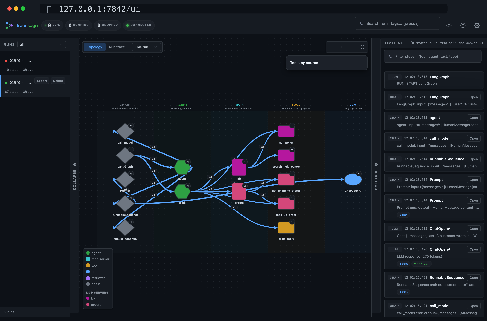

# Concepts: topology node kinds

When a run completes, tracesage groups every callback event into one of
**five "kinds"** of topology nodes — plus a synthesized **`mcp`** node when you
attribute tools to an MCP server:

`agent` &nbsp;·&nbsp; `tool` &nbsp;·&nbsp; `llm` &nbsp;·&nbsp; `retriever` &nbsp;·&nbsp; `chain` &nbsp;·&nbsp; `mcp`

This page is the reference for what each kind means, how tracesage
classifies events into it, and why the distinction matters when you're
debugging a run.

If you opened the UI after running an example and wondered "what does
`agent:something` vs `chain:something` mean?", this is the page.

---

## At a glance



*Every node in the graph is one of the kinds below; the legend (bottom-left) colour-codes them, and MCP servers are listed separately.*

| Kind | What it is | Common examples |
|---|---|---|
| `agent` | A **named function you defined** as a LangGraph node, that calls other components | `agent:billing_agent`, `agent:fact_extractor`, `agent:supervisor` |
| `tool` | A **side-effect function** the agent invokes (DB query, API call, calculation) | `tool:lookup_account`, `tool:run_sql`, `tool:cite_sources` |
| `llm` | A **language model** call (chat or completion) | `llm:FakeListChatModel`, `llm:ChatOpenAI`, `llm:ChatAnthropic` |
| `retriever` | A **`BaseRetriever` subclass** invocation — the "R" in RAG | `retriever:FastFakeRetriever`, `retriever:Chroma`, `retriever:FAISS` |
| `chain` | **Plumbing** — LCEL primitives, the LangGraph state machine, routing functions | `chain:LangGraph`, `chain:RunnableSequence`, `chain:ChatPromptTemplate`, `chain:route_after_quality` |
| `mcp` | An **MCP server** (synthesized, not an event) — groups the tools loaded from that server | `mcp:weather`, `mcp:math`, `mcp:github` |

In the UI, each kind renders with its own color/shape and click-to-detail
behavior. Edges between nodes show "this kind invoked that kind, N times
across all runs".

The topology is **de-duplicated**: a node that runs many times (or a loop, e.g. a
write→critic cycle) is one box with a back-edge, not one box per visit — each individual
invocation/iteration is a separate step in the **timeline / replay**. Parallel and
concurrent (`asyncio.gather`) branches are attributed correctly to their own run/parent
even though they share one tracer — LangChain's `run_id`/`parent_run_id` drives the
grouping, and the handler is safe under concurrency.

### Scope: the topology reflects one version of your app

Because a data dir accumulates many runs, and your app's *structure* changes as you
develop (you add/remove a tool, swap an MCP server, rename a node), a naive all-time
union would show stale nodes forever. So the topology is **scoped**, via the selector
in the graph toolbar:

- **This run** *(default)* — exactly the selected run's structure (the latest run when
  none is selected). One run = one coherent version, so nothing stale ever appears.
- **Last N runs** — union of the N most-recent runs; opt in when you know the structure
  was stable and want to merge runs that took different conditional branches.
- **All time** — every run ever (the historical union).

Removing a tool/server and re-running makes it disappear immediately under "This run".
This applies to the **"Tools by source"** panel too, and even drops a removed MCP
server's registered-but-uncalled tools (a server's tools show only if it was active in
the scoped run). Trade-off: a single run may not exercise every conditional branch —
switch to "Last N" / "All time" when you want broader coverage.

---

## How tracesage decides which kind a node is

When events land in storage, tracesage classifies each event by walking a
priority list (defined in `storage/sqlite_backend.py::get_topology`):

1. **`event_type` first.**
   - `chat_model_start` / `llm_start` / `llm_end` / `llm_error` → **`llm`**
   - `retriever_start` / `retriever_end` / `retriever_error` → **`retriever`**

2. **`tool_name` set** (because the event came from a `BaseTool`)
   - → **`tool`**

3. **`agent_name` matches a known LangChain primitive**
   - `RunnableSequence`, `RunnablePassthrough`, etc.
   - `ChatPromptTemplate`, `StrOutputParser`, `LangGraph`
   - → **`chain`**

4. **Any other `agent_name`**
   - → **`agent`**

5. **Demotion pass.** After the first four steps, any node classified as
   `agent` that has *no descendant events* (no children calling it) is
   demoted to `chain`. This catches LangGraph routing functions (e.g.
   `route_after_quality`) — they get a `chain_start`/`chain_end` pair with
   an `agent_name`, but never call anything, so they're plumbing, not
   cognition.

6. **MCP overlay (synthesized).** If you've registered MCP attribution, tracesage
   also adds one `mcp:<server>` node per server and wires `mcp → tool` and
   `agent → mcp` edges. These don't come from callback events — they're a
   provenance overlay (see [MCP server nodes](#mcp-server-nodes-a-synthesized-node)).

You don't need to remember this rule — it's deterministic and you'll see
the result in the UI directly. The point is: **what's an agent vs. a chain
is a property of what the function actually does at runtime, not what
LangChain calls the callback**.

---

## The five kinds in detail

### `agent` — your code

An `agent` node represents a function **you registered** as a LangGraph
node, that **calls something else** (an LLM, a tool, a sub-agent).
Conceptually: the place "your business logic" runs.

Example agent nodes (you'll build your own — see the [examples gallery](examples.md)):

- A support-triage app: `agent:triage`, `agent:billing_agent`,
  `agent:tech_agent`, `agent:escalation_agent`
- A research pipeline: `agent:ingest`, `agent:retrieve`, `agent:fact_extractor`,
  `agent:sentiment`, `agent:entities`, `agent:synthesize`
- A data-analyst supervisor: `agent:supervisor`, `agent:sql_agent`,
  `agent:chart_agent`, `agent:narrative_agent`

**In the UI:** typically the most prominent nodes — they sit in the middle
of the topology and connect outward to the tools / LLMs / retrievers they
use.

**Why it matters:** edges *from* `agent:` nodes tell you what each part of
your code calls. A common debugging move is "is `agent:answer` reaching
`tool:cite_sources` in every run, or only some?"

### `tool` — side-effect functions

A `tool` node represents a function decorated with `@tool` (or otherwise
registered as a `BaseTool`). Tools do **real work**: DB queries, API calls,
file I/O, calculations. They don't call other things — they're terminal
in the topology.

In the integration guide:

- System 1: `tool:lookup_account`, `tool:issue_refund`, `tool:run_diagnostic`,
  `tool:check_logs`
- System 5: `tool:cite_sources`
- System 9: `tool:flaky_fetch` (this is where the failure path lives —
  `error_count = 1`)

**In the UI:** usually leaves of the topology graph. Their full payload
(via "show full payload") shows the input and output of each invocation.

**Why distinguish from agents?**

- Tools are where you'd add retries, caching, rate-limiting, authn
- Tools are where bugs *outside* the LLM live — wrong query, stale cache,
  bad API response
- "How many tool calls did this run make?" is a useful cost / latency
  signal, separate from "how many agent invocations".

### `llm` — language models

An `llm` node represents a chat model or completion model invocation.
Every direct `model.ainvoke(...)`, `LLMChain`, or LCEL chain ending in an
LLM lands here.

In the integration guide:

- All systems with the default `LLM_PROVIDER=fake`: `llm:FakeListChatModel`
- With `LLM_PROVIDER=openai`: `llm:ChatOpenAI`
- With `LLM_PROVIDER=anthropic`: `llm:ChatAnthropic`
- With multiple models: each appears as a separate `llm:<name>` node

**In the UI:** the LLM step's full payload contains the prompts, the
generated text, and (if the model reports it) `token_usage`. For streaming
models, the `_stream` field shows TTFT, streamed token count, and
tokens/sec (reported when you stream tokens from the model).

**Why distinguish from `chain`?** An LLM call is the thing you want to
**count, cost, and cache**. The `chain:RunnableSequence` that wraps it is
plumbing — it doesn't generate tokens.

### `retriever` — context fetchers

A `retriever` node represents a `BaseRetriever` subclass invocation. This
is the "R" in RAG: vector stores, BM25, hybrid search, custom retrievers.

Examples (see the RAG apps in the [examples gallery](examples.md)):

- A research pipeline: `retriever:_FixedCorpusRetriever`
- A two-stage RAG app: a fast `retriever:` followed by an `llm:` reranker — the
  reranker is an LLM invocation in this design, not a second retriever.

In production: `retriever:Chroma`, `retriever:FAISS`,
`retriever:MultiQueryRetriever`, `retriever:ParentDocumentRetriever`, etc.

**In the UI:** retrievers have their own callback events
(`retriever_start` / `retriever_end`) that capture the query *and* the
returned documents (with their metadata, and relevance scores when the retriever
provides them) in one structured payload. The node label is `retriever:<class name>`
of the `BaseRetriever` subclass whose callback fired (e.g. `retriever:Chroma`).

**Why distinguish?** Retrieval quality is its own debugging dimension.
"Did we retrieve the right docs?" is a different question from "Did the
LLM use them well?". When you have multiple retrievers (e.g. fast index
+ reranker), you want to see them as separate boxes in the
topology so you can compare their behavior.

### `chain` — plumbing

A `chain` node represents **infrastructure**, not business logic. It
covers four things:

1. **LCEL `RunnableSequence`** — the value `prompt | llm | parser`
   produces. tracesage decomposes the sequence into its components, so an
   LCEL chain shows up as `chain:RunnableSequence` connected to
   `chain:ChatPromptTemplate`, `llm:<name>`, and `chain:StrOutputParser`.
2. **LCEL primitives** — `ChatPromptTemplate`, `StrOutputParser`,
   `RunnablePassthrough`, `RunnableLambda`, etc.
3. **The LangGraph state machine itself** — `chain:LangGraph` appears in
   every run as the orchestrator that dispatches between your nodes.
4. **Demoted "agents" with no children** — typically routing functions in
   `add_conditional_edges`, e.g. `chain:route_after_critic`,
   `chain:route_after_supervisor`.

Examples:

- Every LangGraph app: `chain:LangGraph` (the orchestrator)
- LCEL pipelines decompose — you'll see `chain:RunnableSequence`,
  `chain:ChatPromptTemplate`, `chain:StrOutputParser` each at multiple
  invocations
- A writer-critic loop: `chain:route_after_critic` — a routing function with no
  LLM/tool inside, demoted from `agent` to `chain`

**In the UI:** usually upstream of agents — they're the "wrapping"
machinery.

**Why distinguish from `agent`?** Counting `chain:LangGraph` and
`chain:route_after_critic` as agents would inflate the "how many of my
agents ran" metric to noise. Real agents do reasoning; chains are
plumbing. Keeping them separate makes per-agent metrics meaningful.

---

## MCP server nodes (a synthesized node)

The five kinds above each map to a LangChain *callback event*. There is one more
node type you'll see in the topology — **`mcp`** — but it is **synthesized**, not
emitted by a callback.

When you attribute tools to their MCP server (via `register_mcp_client`, see
[mcp.md](mcp.md)), tracesage adds one `mcp:<server>` node per server and draws edges
**mcp → tool** (the tools that server provides) and **agent → mcp** (agents that called
them). The tool nodes themselves are still ordinary `tool` nodes — the `mcp` node is a
grouping/provenance overlay so you can answer "which tools came from which server, and
which are hardcoded?" A server's tools appear even if a given run never called them.

`mcp` nodes only exist when you've registered MCP attribution; a pure-LangChain trace
has just the five event-based kinds.

---

## Putting it together: a research pipeline walked through

A representative research-pipeline topology — run any app in `examples/showcase/`
to see your own — decomposes like this:

```
[topology]
chain:LangGraph              ← the LangGraph orchestrator
├ agent:ingest               ← your `ingest()` LangGraph node
│   ├ tool:web_search        ← @tool function
│   ├ tool:fetch_document    ← @tool function
│   └ llm:FakeListChatModel  ← LLM call inside ingest()
├ agent:retrieve             ← your `retrieve()` LangGraph node
│   └ retriever:_FixedCorpusRetriever  ← BaseRetriever subclass
├ agent:fact_extractor       ← your `fact_extractor()` node
│   └ llm:FakeListChatModel  ← LLM call (same model class as above)
├ agent:sentiment            ← parallel branch
│   └ llm:FakeListChatModel
├ agent:entities             ← parallel branch
│   └ llm:FakeListChatModel
└ agent:synthesize
    ├ llm:FakeListChatModel
    └ tool:cite_sources
```

So when you saw 12 topology nodes after running 3 topics, they were:

- 6 × `agent:` (your LangGraph nodes)
- 1 × `chain:LangGraph` (the orchestrator)
- 1 × `llm:FakeListChatModel` (one node, multiple invocations)
- 1 × `retriever:_FixedCorpusRetriever`
- 3 × `tool:` (web_search, fetch_document, cite_sources)

The same logic applies to every app in the [examples gallery](examples.md).

---

## Event types vs topology kinds

There's a separate-but-related concept worth knowing: **event types**.
A topology kind tells you *what a node is*; an event type tells you *what
just happened*. Each topology kind is fed by a specific subset of event
types:

| Kind | Event types that produce it |
|---|---|
| `agent` | `chain_start`, `chain_end`, `chain_error`, `agent_action`, `agent_finish` (with a non-primitive `agent_name` and descendants) |
| `tool` | `tool_start`, `tool_end`, `tool_error` |
| `llm` | `llm_start`, `llm_end`, `llm_error`, `chat_model_start` |
| `retriever` | `retriever_start`, `retriever_end`, `retriever_error` |
| `chain` | Same as `agent`, but with primitive `agent_name` *or* no descendants |
| `mcp` | None — **synthesized** from MCP tool attribution, not a callback event |

The synthetic `run_start` event is tracesage-internal and doesn't produce
a topology node — it exists so the dashboard's run list gets a lifecycle
ping when a root run begins. (`run_end` is a reserved event type but is not
currently emitted; run completion is inferred from the root chain ending.)

## Summary vs. request/response payload

Each step in the timeline has two levels of detail:

- **Summary** — a short, truncated **one-line preview** (e.g. `weather_agent:
  input={…}`), capped by `summary_max_chars`. It's there so you can scan the
  timeline quickly without opening anything.
- **Request / Response payloads** — the *full* data, stored as gzipped blobs.
  A step pairs its `*_start` event (the **request**: inputs / prompt / query)
  with its `*_end` event (the **response**: outputs / result). Click any step
  in the UI and the drawer shows both, side by side, plus tokens, duration, and
  any error.

---

## Where to go next

- **Run an example to see the kinds in your own UI:**
  `python examples/showcase/11_supervisor_research_team/after.py`
  then open `http://localhost:7842/ui`
- **Browse the gallery** to see different combinations of kinds:
  [the examples gallery](examples.md)
- **Check the topology source-of-truth** in `src/tracesage/models.py`
  (the `TopologyNode` and `EventType` definitions) and
  `src/tracesage/storage/sqlite_backend.py::get_topology()` (the
  classification SQL).
