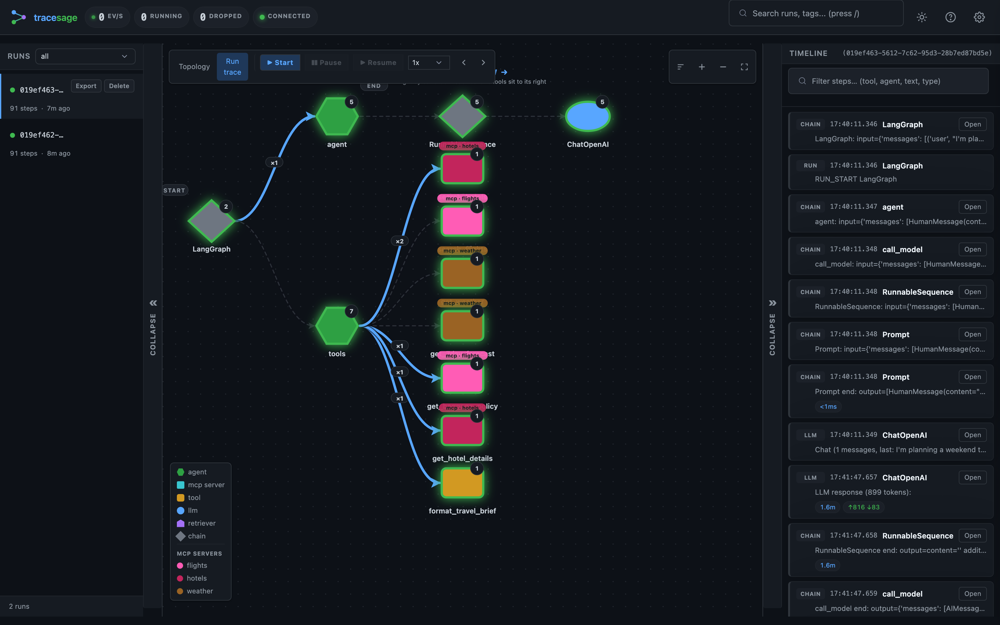
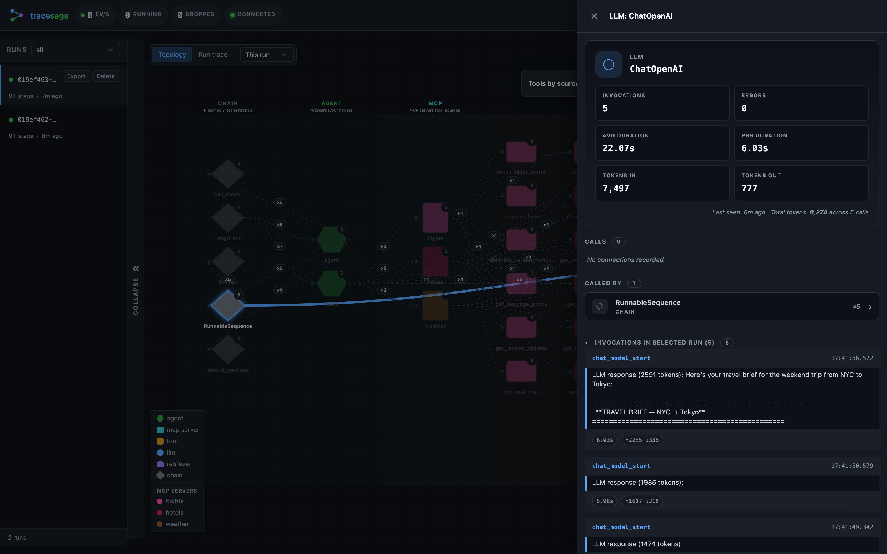
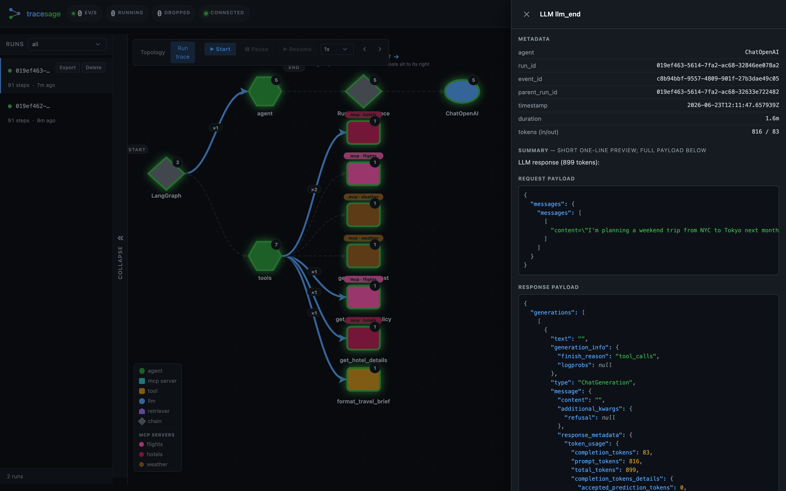

<p align="center">
  
</p>

# tracesage

**Local-first observability for LangChain & LangGraph multi-agent systems.**
Drop in two lines, see live execution traces in your browser.

```python
from tracesage import TraceSage

tracer = await TraceSage.create()                          # one-time setup

result = await graph.ainvoke(
    {"input": payload},
    config={"callbacks": [tracer.handler]},                # only line you add
)

# Open the URL tracesage prints (default http://localhost:7842/ui) to see it live
```

[Get started in 5 minutes →](quickstart.md){ .md-button .md-button--primary }
[Browse the examples →](examples.md){ .md-button }

---

## Why tracesage

LangChain agents emit a rich callback stream — chain start/end, tool start/end,
LLM start/end, retrieval, errors. tracesage captures all of it without
changing your workflow logic, persists it locally (SQLite + gzipped blobs),
and renders it in an interactive graph + timeline UI in real time.

- **Zero infrastructure.** No Docker. No Postgres. No external services. `pip install`.
  The UI is fully self-contained (assets vendored, no CDN) and works offline.
- **Two-line integration.** One callback added to your existing `ainvoke`.
- **Crash-safe by design.** The handler never raises and the tracer never crashes
  your pipeline.
- **Interactive graph view.** Custom SVG graph (no framework), auto-laid-out. Hover, click, replay any run.
- **MCP-aware.** Tools loaded from MCP servers are attributed by source — see which tools
  came from which server vs. which are hardcoded. See [MCP support](mcp.md).
- **OpenTelemetry export.** Optionally ship every trace as OTel spans to a collector /
  Tempo / Jaeger / Datadog / Honeycomb — the bridge to your production stack. See
  [Configuration → OpenTelemetry export](configuration.md).
- **Pluggable storage.** SQLite today; Postgres / remote-collector / object-store backends planned.
- **MIT licensed.** Free forever.

## Where to go next

<div class="grid cards" markdown>

-   :material-rocket-launch: **[Quickstart](quickstart.md)**

    Install, run an example, open the UI. Five minutes.

-   :material-graph: **[Concepts](concepts.md)**

    What `agent`, `tool`, `llm`, `retriever`, `chain`, and `mcp` mean — read
    this first if you want to interpret a topology.

-   :material-cog: **[Configuration](configuration.md)**

    Every `TRACESAGE_*` env var explained.

-   :material-shield-check: **[Deploying & hardening](production.md)**

    Auth, sampling, retention, the safety rails, and the OTel bridge to your stack.

-   :material-book-open-variant: **[Examples](examples.md)**

    30 before/after apps across popular use cases. Pick the closest match to
    your architecture and copy the integration.

-   :material-console: **[CLI reference](cli.md)**

    `tracesage serve` / `export` / `stats` / `runs` / `gc`.

-   :material-puzzle: **[Extending](extending.md)**

    Adding framework adapters and storage backends.

</div>

## What you'll see

<table>
  <tr>
    <td width="50%"></td>
    <td width="50%"></td>
  </tr>
  <tr>
    <td align="center"><em>Topology — the system architecture by node kind.</em></td>
    <td align="center"><em>Run-trace — one run as a call tree, with the step timeline and replay controls.</em></td>
  </tr>
</table>

Once a run lands, the UI shows:

- **Run list** — every run with status, tags, started-at, total steps, total tokens,
  and a toast when a watched run completes or fails
- **Graph pane** — toggles between two views:
    - **Topology** — agent / tool / chain / retriever relationships by kind, scoped to the
      selected run by default (a toolbar selector switches to last-N-runs / all-time)
    - **Run-trace** — one selected run laid out as a left → right call tree in call order
- **Timeline** — chronological steps; a `*_start` shows its request, a `*_end` the full
  **request + response** payloads (MCP-backed tools are tagged with their server)
- **Step-through replay** — explicit Start / Pause / Resume plus Prev / Next manual
  stepping (1x / 2x / 5x); clicking a timeline step jumps the cursor there
- **Node inspector** — click any node for its stats; LLM nodes show token usage (in / out)

Keyboard: `j` / `k` next/prev run, `/` focus search, `t` theme, `Esc` close, `?` help.

### Header stats

The top bar shows live health at a glance (plus the optional
[project name](configuration.md) next to the brand):

| Chip | Meaning |
|---|---|
| **ev/s** | Trace events received per second, as a **1-minute rolling average** (events in the last 60 s ÷ 60). A quick pulse that capture is flowing — it rises while a run is active and decays to 0 when idle. |
| **running** | How many **root runs are currently in progress** (`runs_active` from `/api/stats`; falls back to counting `running` rows in the list). |
| **dropped** | Events **dropped because the ingestion queue was full** (backpressure). Should stay **0**; the chip turns red if not. If it climbs, lower `sample_rate` or raise `queue_maxsize` — see [Deploying & hardening → what to monitor](production.md). |
| **connection dot** | The live **WebSocket link** to the server: *connected* (updates streaming in real time), *connecting*, or *disconnected* (it auto-reconnects with backoff). |

`ev/s` is computed in the browser from the event stream; `running` and `dropped`
come from [`GET /api/stats`](api.md), polled periodically.

### Watch a trace stream in

<video controls muted playsinline width="100%" poster="assets/ui-topology.png">
  <source src="assets/tracesage-demo.mp4" type="video/mp4">
  Your browser can't play embedded video —
  <a href="assets/tracesage-demo.mp4">download the demo clip</a> instead.
</video>

### Inspect any node

Click a node to open its drawer — counts, durations, errors, the tools it provides
or uses, and (for MCP) its server of origin. **LLM** nodes show token usage
(in / out, total across calls).

<table>
  <tr>
    <td width="50%"></td>
    <td width="50%"></td>
  </tr>
  <tr>
    <td align="center"><em>LLM inspector — token usage (in / out, total across calls) and latency.</em></td>
    <td align="center"><em>MCP server inspector — provided tools, invocations and callers.</em></td>
  </tr>
  <tr>
    <td width="50%"></td>
    <td width="50%"></td>
  </tr>
  <tr>
    <td align="center"><em>“Tools by source” — tools grouped by origin (MCP vs. local).</em></td>
    <td align="center"><em>Any step → its full request and response payloads.</em></td>
  </tr>
</table>

## Status

**Beta.** API may still shift before v1.0. The PyPI badge shows the published version,
stamped by the release workflow when a version actually ships (so it matches PyPI).
Built for local development and single-process tracing, with OpenTelemetry export to
bridge into a central stack; native multi-process / remote-collector storage is on the
roadmap. Today the **only shipped adapter is LangChain / LangGraph** — the core is
framework-neutral and CrewAI / AutoGen / LlamaIndex adapters are
[planned](extending.md#adapters-on-the-roadmap), not yet available. See the
[changelog](changelog.md) for release notes.
