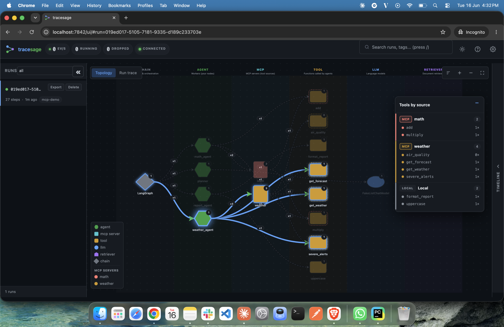
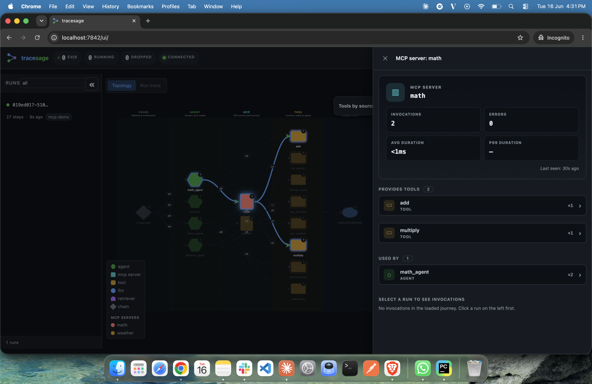

# MCP tool-source attribution

When your agent's tools come from [Model Context Protocol](https://modelcontextprotocol.io)
servers (loaded via [`langchain-mcp-adapters`](https://github.com/langchain-ai/langchain-mcp-adapters)),
tracesage can attribute each tool call to the MCP server it came from — so you can
see, at a glance, *"these 10 tools came from 2 MCP servers; these 2 are hardcoded
in my workflow."*

## Install

MCP support is an optional extra (the core package never imports it):

```bash
pip install 'tracesage[mcp]'
```

The `[mcp]` extra installs `langchain-mcp-adapters>=0.1.0`, `mcp>=1.0.0`, and `langgraph`.
If you already manage those yourself, any `langchain-mcp-adapters>=0.1.0` works.

## Register tool sources

LangChain tools don't reliably carry their originating MCP server, so tracesage
records the mapping explicitly. Do this once at setup, before invoking your graph:

```python
from langchain_mcp_adapters.client import MultiServerMCPClient
from tracesage import TraceSage
from tracesage.adapters.mcp import register_mcp_client

tracer = await TraceSage.create()

client = MultiServerMCPClient({
    "weather": {"command": "python", "args": ["weather_server.py"], "transport": "stdio"},
    "math":    {"command": "python", "args": ["math_server.py"],    "transport": "stdio"},
})

# Loads every server's tools AND records tool -> server provenance.
mcp_tools = await register_mcp_client(tracer, client)

# Your own @tool functions stay "local" (unattributed) automatically.
all_tools = mcp_tools + [my_local_tool]
```

`register_mcp_client` is **async** (loading tools from `MultiServerMCPClient` is async). In
a synchronous app, load + register inside an `asyncio.run(...)` startup block, then use the
returned tools with your sync agent.

If you load tools per server yourself, attribute them explicitly (this call is sync):

```python
from tracesage.adapters.mcp import register_mcp_tools
register_mcp_tools(tracer, weather_tools, server="weather")
```

Or register a single tool name:

```python
tracer.register_tool_source("get_weather", "weather")
```

### Auto-detection (best-effort)

Even without registration, tracesage tags a tool whose call carries
`metadata={"mcp_server_name": "..."}`. Explicit registration is the reliable path;
auto-detection is a fallback.

## Where it shows up

- **UI** — a "Tools by source" panel (top-right of the graph pane) groups tools as
  `MCP: weather (4) · MCP: math (2) · Local (2)`. Clicking a tool node shows its
  source in the drawer.
- **REST** — `GET /api/tools` returns the grouped inventory; topology tool nodes
  carry a `source` field. See the [API reference](api.md).
- **Storage** — provenance is persisted on each tool event (`events.mcp_server`),
  so it survives restarts and is visible in `tracesage serve` mode.



*The "Tools by source" panel groups every tool as MCP `math`, MCP `weather`, or `Local`.*



*Clicking an MCP server node shows its invocations, errors, the tools it provides, and which agents use it.*

## Try it

A runnable end-to-end scenario (two local stdio MCP servers + two hardcoded tools,
no API key) lives in [`examples/mcp/`](https://github.com/kjgpta/tracesage/tree/main/examples/mcp):

```bash
pip install 'tracesage[mcp]'
python examples/mcp/main.py    # then open http://localhost:7842/ui
```
